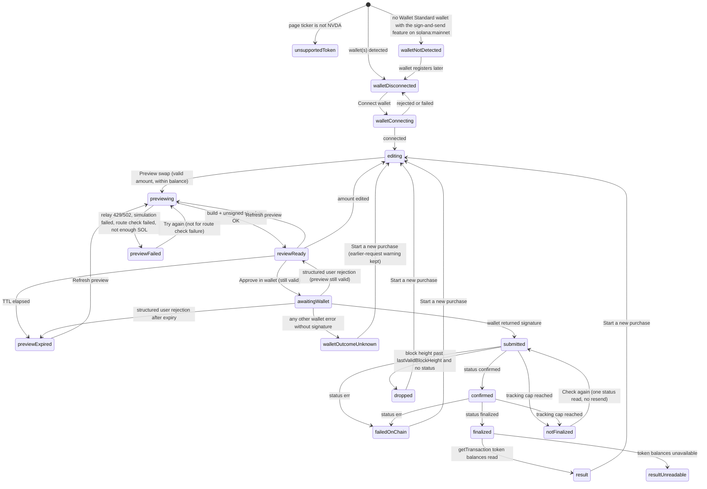

# NVDAx purchase panel: design contract

Status: **design artifact for P1-2, `review_pending`.** Written 2026-09-24 JST for the [Stocklana submission plan](../../specs/stocklana-submission-plan-2026-09-23.md) (sections 1, 2 and P1-2 are the requirement source). This document and its images do not implement anything, do not record human design acceptance and do not by themselves authorize a funded transaction. Gate G-B2 (a funded smoke of at most 1 USDC) stays with the user.

Scope: one purchase panel on the existing stock page, `/stock/NVDA` and its four locale variants, that lets an individual investor buy NVDAx with USDC in their own wallet through the pinned Meteora DLMM pool, and then verify what they received. Every other stock page shows a clear "not available" notice in the same slot. Nothing else on the stock page changes except the two-column band described in [Placement](#2-placement).

Relation to earlier documents: the plan's 2026-09-23 user decision replaced the earlier "no purchase UI" invariant for this one route. The [README boundary](README.md#current-information-ui-and-future-purchase-boundary) statements that no purchase UI exists are therefore historical for NVDAx once this panel ships; its safety and quality requirements (unknown post-send outcomes stay unresolved, the known signature is looked up, nothing resends automatically, five locales stay meaning-equivalent, focus/zoom/touch/reduced-motion criteria) are carried into this contract. The [investor journey plan](investor-journey-plan.md) and [spot acquisition proposal](spot-acquisition-design.md) are background; their separate `/purchase` workspace, hierarchy and images are **not** adopted. This panel lives inside the stock page.

Screenshot rubric for the independent visual review after implementation: [purchase-panel-screenshot-rubric.md](purchase-panel-screenshot-rubric.md).

## Visual direction images

All four images are Codex built-in image generations, restyled from real screenshots of the current `/stock/NVDA` page at `1440 × 900` and `390 × 844` so that they keep the shipped tokens. They are registered in [generated-image-manifest.v1.json](generated-image-manifest.v1.json) with `review_status: review_pending`. Exact prompts are in [prompts/](prompts/).

| State | Image | SHA-256 | Raster | Intended viewport | Generated (JST) |
| --- | --- | --- | --- | --- | --- |
| Desktop, review ready (waiting for approval) | [2609240653_benten_nvda-purchase-review_mineral-ink.png](assets/2609240653_benten_nvda-purchase-review_mineral-ink.png) <!-- generated-image-current:benten/nvda-purchase-review/mineral-ink --> | `11ae85547cc91dda0a1278ed05b6b2d1486d0fe3233160c329e605e91f23557b` | 1586 × 992 | 1440 × 900 | 2026-09-24 06:53:03 |
| Desktop, finalized with result | [2609240653_benten_nvda-purchase-finalized_mineral-ink.png](assets/2609240653_benten_nvda-purchase-finalized_mineral-ink.png) <!-- generated-image-current:benten/nvda-purchase-finalized/mineral-ink --> | `b7d33d226c5d36d6eca134480fb030fc06cf240b9fce449d1a5e8344765fad1a` | 1586 × 992 | 1440 × 900 | 2026-09-24 06:53:28 |
| Desktop, error: preview expired | [2609240653_benten_nvda-purchase-expired_mineral-ink.png](assets/2609240653_benten_nvda-purchase-expired_mineral-ink.png) <!-- generated-image-current:benten/nvda-purchase-expired/mineral-ink --> | `feabea42b9d63aed8093d17352e811cb6da23e83e8764ecadbb7b4a1db59a98e` | 1586 × 992 | 1440 × 900 | 2026-09-24 06:53:37 |
| Mobile board: review ready, finalized, error "not finalized yet" | [2609240653_benten_nvda-purchase-mobile-states_mineral-ink.png](assets/2609240653_benten_nvda-purchase-mobile-states_mineral-ink.png) <!-- generated-image-current:benten/nvda-purchase-mobile-states/mineral-ink --> | `18d7be93501b81abaf56e5096a9547da5031bb5621802bec7e957dac08f004f9` | 1475 × 1067 (three screens) | 390 × 844 each | 2026-09-24 06:53:06 |

Prompts: [review](prompts/2609240653_benten_nvda-purchase-review_mineral-ink.txt), [finalized](prompts/2609240653_benten_nvda-purchase-finalized_mineral-ink.txt), [expired](prompts/2609240653_benten_nvda-purchase-expired_mineral-ink.txt), [mobile states](prompts/2609240653_benten_nvda-purchase-mobile-states_mineral-ink.txt). Each prompt was sent with one real screenshot of the current `/stock/NVDA` page (1440 × 900 or 390 × 844) as the visual reference; those screenshots were temporary and are not repository artifacts. Selection reason: each is the single candidate generated for its state; all four keep the current page frame, tokens and density, make the panel the only primary action, and show the state's primary action and error treatment as specified, so no second iteration was needed within the time box.

To inspect the bytes from the repository root:

```sh
shasum -a 256 docs/ui-design/assets/2609240653_benten_nvda-purchase-*_mineral-ink.png
```

What the images establish: the two-column band with the panel on the right, the order of blocks inside the panel, the calm density, the pine-green progress trail and the large received figure as the one memorable element, and that errors use a tinted notice with an icon and words, not colour alone. What they do not establish: exact pixels, copy (this document's copy table is authoritative where an image differs), interaction, accessibility, real numbers or addresses. Every number and address in the images is a specimen. The expected output `441982`, minimum `437562` and fee `2250` / protocol `250` come from the G-B1 run in the plan; wallet address, signature, balance, times and price impact are invented specimens and must never be copied into code or fixtures as real data.

Known image deviations that this contract corrects:

- Notice position: the review mock shows `Before you buy` directly under the route line; that is the contract position in **every** state. The finalized mock shortens it to one line at the bottom and the expired mock moves it to the bottom; both are wrong (see [Notice](#31-notice)).
- Expired preview: the mock strikes through the old values. The contract dims them (`--color-muted`) without strike-through, so they stay legible at 200% zoom; the `Expired` value and the error notice carry the meaning. The mock's error tint is more saturated than `--color-attention-surface`; the token wins.
- Finalized: `Copy signature` appears grey in the mock; it is the standard quiet action style (`--color-action`, underlined).
- Mobile board: each screen is cropped to the panel and does not show the vertical page order. The registry record sits between the title and the panel, with the jump link under the title (see [Placement](#2-placement)). Screen 3 omits `Preview reviewed`; the trail always lists all five steps.
- The review mock's footnote says Benten "sends once and never retries automatically". The wallet sends; the contract copy is `Your wallet shows the network fee in SOL. Benten asks your wallet to send once and never resends.`
- Generated lettering may misspell or reflow text; the copy table below wins.

## 1. Job, user and boundaries

- User: an individual investor who already reads the NVDA page and holds USDC in a Solana wallet.
- Job: see exactly what one wallet approval will do, approve it once, and verify how many NVDAx units arrived.
- Success: the investor can state, before approving, the raw and display USDC amount, the expected and minimum NVDAx, the fees, the slippage tolerance and when the preview expires; after finality they see the NVDAx balance change taken from the transaction itself, with a link to check it independently.
- Benten builds an unsigned transaction in the browser and reads the network only through the read-only relay (`/api/solana-rpc`). The user's wallet signs **and sends** it (the Wallet Standard sign-and-send feature; its identifier is confined to `apps/web/lib/purchase/wallet-standard.ts` by `scripts/check-publishable.sh`). Benten never calls a send method; the relay rejects them anyway.
- No advice, ranking, recommendation or forecast. No "best", "recommended", "popular" or similar wording, no rate or "1 NVDAx =" line, and the numbers are never called a quote, a price or NAV in user-facing copy. The user-facing term is **swap preview**. Code identifiers such as `BuildSwapResult.quote` may keep their names; they never reach the UI as words.

## 2. Placement

### Desktop (width 52rem and wider, the existing single breakpoint)

The title block (breadcrumb, `NVDA NVIDIA xStock`, coverage badge) stays full width. Below it the page becomes a two-column band:

```text
+----------------------------------------------------------------------------------+
| header (unchanged)                                                               |
+----------------------------------------------------------------------------------+
| <- All xStocks                                                                   |
| NVDA NVIDIA xStock                                                               |
| [Financials]                                                                     |
|                                                                                  |
| +-- main column (minmax(0, 1fr)) ----------+  +-- purchase aside (26rem) ------+ |
| | Registry record                          |  | Buy NVDAx with USDC            | |
| | (existing FactTable)                     |  | route line                     | |
| |                                          |  | wallet step                    | |
| | Legacy snapshot / periods (existing)     |  | amount field                   | |
| |                                          |  | swap preview / trail / result  | |
| |                                          |  | one primary action             | |
| |                                          |  | Before you buy (4 sentences)   | |
| +------------------------------------------+  +--------------------------------+ |
+----------------------------------------------------------------------------------+
```

- The aside is `position: sticky` while the main column scrolls, only at the desktop breakpoint. It never has an internal scroll area and no max-height (`align-self: start`). Its top is `min(--purchase-panel-sticky-top, 100dvh - panel height - --purchase-panel-sticky-top)`, with the height measured at runtime by `StickyAside` into `--purchase-panel-height` (`data-fits` mirrors the outcome). A panel that fits keeps the normal offset; a taller one is held by its bottom edge `--purchase-panel-sticky-top` above the viewport bottom, so the primary action, which sits near the end of the panel, stays visible while the page scrolls. Sticky is kept rather than switched off for tall panels, because a static panel would scroll the action away instead. (Changed 2026-09-24 after visual QA: the earlier fixed offset left the action below the fold in every state taller than the viewport.)
- Column gap `--space-6`. The aside width is the new token `--purchase-panel-width`.
- The panel is the only filled primary button on the page.

### Mobile (below 52rem, checked at 390 × 844)

Single natural scroll:

```text
<- All xStocks
NVDA NVIDIA xStock
[Financials]
[Buy NVDAx with USDC]   quiet 44px link, jumps to #purchase
Registry record (existing)
Buy NVDAx with USDC (panel, full width)
Legacy snapshot (existing)
```

The investor reads the exact token identity (registry record, mint) before the panel. The jump link under the title keeps the panel one tap away. The link text equals the panel heading so the action keeps one name. Focus moves to the panel heading when the link is used.

### Other stock pages

Same slot (right column on desktop, after the registry record on mobile), no jump link:

- Heading: `Purchase not available for {symbol}`
- Body: `Benten supports buying only NVDAx with USDC, through one fixed pool. Benten offers no purchase for this token.`
- Surface: `--color-surface-quiet`, no border, no button, no link to NVDA (a link would steer the investor to one token).

The support check is an exact comparison against the pinned constant (`NVDAX_MINT` from `lib/purchase/build-swap.ts`) on the registry entry resolved by `resolveTicker`; never a name or ticker substring.

## 3. Panel content, in order

1. **Heading** `Buy NVDAx with USDC` (h2, same scale as `section__title`, id `purchase-heading`).
2. **Route line** (muted, small): `One fixed route: Meteora DLMM pool {poolShort}. You approve and send in your own wallet. Benten never signs or holds funds.` The pool address is shortened in view and copyable in full with the existing `CopyValue`.
3. **Before you buy** notice (section 3.1).
4. **Wallet step** (state dependent, see section 5).
5. **Amount field** (after a wallet is connected).
6. **Swap preview**, then the **progress trail** and **result** as the flow advances. These replace each other in place; they do not stack as a history.
7. **One primary action** for the current state, plus at most one quiet secondary action, then the muted footnotes.

### 3.1 Notice

Always rendered, in every state including unsupported-wallet, error and finalized, as the existing `.notice` pattern (`--color-surface-quiet`, 3px `--color-muted` left border). Title `Before you buy`, then four sentences, each its own line:

- `The issuer does not offer or sell NVDAx to US persons, and transfers may only be made to non-US persons.`
- `Benten does not check whether you are eligible.`
- `Availability from any country is not guaranteed.`
- `This is not investment advice.`

Position: directly after the route line, in the same place in every state, so it is read before connecting, before the first preview and again beside every approval. It is never collapsed behind a disclosure, shortened or moved to the bottom. On desktop, once the panel reaches `reviewReady` (the user has scrolled to it and used the amount field), the sticky panel, notice on top through the approve button, fits inside the 1440 × 900 viewport. It is not required to fit the page's first view: the panel's top aligns with `Registry record` (placement rule, rubric V1), which starts below the title band. `previewExpired` also fits (section 3.2). States that carry more content than the viewport, such as `reviewReady` after an unknown wallet outcome (the earlier-request warning) and `awaitingWallet` (preview plus trail), are held by their bottom edge (section 2), so their action stays visible; their top part, including the notice, is read before that point as the page scrolls.

### 3.2 Swap preview rows

A `<dl>` with hairline row rules; label left, value right with tabular figures; a muted raw value with each amount. Desktop keeps label and value on one row, with the raw value and the absolute expiry time on the same line just left of their value (values stay right-aligned); mobile and 200% zoom stack label above value and put the raw value under it. (Changed 2026-09-24 after W2b QA NG-5: with the default card size, the raw lines under each value pushed `reviewReady` past the 1440 × 900 viewport; beside the value they keep a 24px top margin.) (Changed 2026-09-25 after final QA NG4: at 390 × 844 the pool fee, slippage and expiry were below the pinned `Approve in wallet`. Every width now keeps the three amounts (you pay, expected, minimum) on one full-width row each, the raw value on the value's line, wrapping under the label only when the line is too narrow, as at 200% zoom; pool fee, slippage tolerance, price impact and expiry follow as a two-column table of small label-over-value cells, in that order. The connected wallet row is one line, `Disconnect` keeping its touch-sized hit area by overhanging the line. At 390 × 844 in `reviewReady` the approve button and `Minimum you receive`, `Pool fee`, `Slippage tolerance` and `Preview expires` are on one screen, with `Before you buy` unchanged above them.)

Expired preview (`previewExpired`): heading `Expired swap preview` (`purchase.preview.headingExpired`); values in `--color-muted` at weight 400, never struck through; the only secondary line kept is the expiry time (`at {HH:mm:ss}`). The raw lines, the minimum note and the notes under the list are omitted, because they exist to be compared with the wallet at approval, which an expired preview no longer allows; the refreshed preview shows them again. This keeps the expired panel inside the 1440 × 900 viewport at its normal sticky offset.

| Row | Value | Secondary line | Source |
| --- | --- | --- | --- |
| You pay | `{usdcDisplay} USDC` | `raw {inputRaw}` | `input.amountRaw`; also show `consumedInputRaw` if it differs, as `Used by the pool: {consumedDisplay} USDC (raw {consumedRaw})` |
| Expected to receive | `{nvdaxDisplay} NVDAx` | `raw {outputRaw}` | `quote.outputRaw` |
| Minimum you receive | `{minDisplay} NVDAx` | `raw {minimumOutputRaw}` + `The transaction fails instead of giving you less than this.` | `quote.minimumOutputRaw` (enforced on chain) |
| Pool fee | `{feeDisplay} {feeToken}` | `Includes protocol share {protocolDisplay} {feeToken}` | `quote.feeRaw`, `quote.protocolFeeRaw`; `feeToken` is USDC when `feeOnInput`, NVDAx otherwise |
| Slippage tolerance | `1.00%` | | `slippageBps` from config |
| Price impact | `{priceImpactPct}%` | | `quote.priceImpactPct`, pool-state estimate, shown with two decimals, `<0.01%` when smaller |
| Preview expires | `in {m:ss}` then `Expired` | `at {HH:mm:ss}` (absolute local time) | preview build time plus `previewTtlMs` |

Under the list, muted notes as applicable, run together as one short paragraph:

- `NVDAx amounts use the display multiplier read from the mint at {HH:mm:ss}.` If the multiplier read fails: `The NVDAx display multiplier could not be read. NVDAx amounts are shown in raw units only.` (the raw line becomes the value; the flow is not blocked, because the transaction enforces raw units).
- If the built transaction contains an associated-token-account creation instruction for NVDAx: `This transaction also creates your NVDAx token account. Your wallet shows the one-time SOL deposit.`
- Always: `Your wallet shows the network fee in SOL. Benten asks your wallet to send once and never resends.`

## 4. Amount model

- USDC: legacy SPL Token, 6 decimals. NVDAx: Token-2022, 8 decimals. Decimals come from the mint accounts read at preview time, and must equal the pinned expectations (6 and 8) or the flow stops with the route-check error.
- Input parsing is string to `bigint` with no floating point: accept `^\d+(\.\d{1,6})?$` after trimming; `.` is the only decimal separator in every locale (the field label says USDC; helper and error copy say so). No grouping separators are accepted in input.
- The helper under the field shows the live raw integer: `{raw} raw units. USDC uses 6 decimals.`
- NVDAx display amount: `raw × multiplier ÷ 10^8`, computed as decimal-string arithmetic, **truncated toward zero** to 8 fraction digits so a display never overstates. The multiplier is read at preview time (and again at result time) from the NVDAx mint's Token-2022 Scaled UI Amount extension: use `newMultiplier` when the current time is at or after `newMultiplierEffectiveTimestamp`, else `multiplier`. Never a stored constant.
- USDC display: exact `raw ÷ 10^6`, trailing zeros trimmed to a minimum of two fraction digits.
- Digits are grouped per locale for display only (existing `lib/i18n/format.ts` helpers, extended if needed); raw lines are shown ungrouped so they can be compared with a wallet or explorer exactly.

## 5. State machine

Two parallel concerns: the wallet connection and the purchase attempt. The attempt machine only runs while a wallet is connected, except the post-send states, which keep tracking the known signature even if the wallet disconnects.



Rules:

- **Send once.** `Approve in wallet` asks the wallet to sign and send exactly once for one preview. The button becomes busy and inert (`aria-disabled`, no second call) until the wallet answers. Benten never re-invokes it for the same preview and never rebuilds and sends automatically. A wallet's own rebroadcast of the same signed transaction cannot buy twice; Benten does not pass options that change the wallet's default send behaviour.
- **Expiry check happens twice**: the countdown moves the UI to `previewExpired`, and the approve handler re-checks the clock before calling the wallet.
- **Edits invalidate.** Changing the amount after a preview discards it (back to `editing`); the preview never silently re-quotes.
- **Tracking** polls `getSignatureStatuses` every `statusPollIntervalMs`; on relay 429 it doubles the interval up to `statusPollMaxIntervalMs`; it stops at `statusPollTimeoutMs` (`notFinalized`) or at a terminal status. `dropped` is shown only when the current block height is above the transaction's `lastValidBlockHeight` and a status read with transaction-history search still returns nothing.
- **Result** reads `getTransaction` once through the relay (finalized, `encoding: "base64"`, `maxSupportedTransactionVersion` from `PURCHASE_CONFIG`, currently `1`) and computes, for the connected wallet as owner and the NVDAx mint, `sum(post.uiTokenAmount.amount) - sum(pre.uiTokenAmount.amount)` as `bigint` (missing pre entry counts as 0). The same for USDC gives the amount paid. Never from the preview numbers. The transaction itself is requested as base64 and never decoded; only `meta.err` and the pre/post token balances are read, strictly (`readFinalizedTransactionMeta` in `packages/purchase/src/rpc.ts`). The version limit is `1` because version 1 transactions exist on mainnet and asking with `0` makes the RPC answer `-32015` for them; the token balances in `meta` do not depend on the message version. (Changed 2026-09-24: this line said `maxSupportedTransactionVersion: 0`.)
- **Disconnect during flow**: before `submitted`, disconnect returns to `walletDisconnected` and discards the preview. From `submitted` on, the trail keeps tracking the known signature and the result is computed for the wallet public key that approved it.
- **Reload**: the purchase state lives in the app-level purchase store for the visit, and every attempt transition is also written to this browser's Activity history (app IA sections 5.2 and 5.4, change C5), so the known signature survives a reload on the same device. The submitted and confirmed states say `You can leave this screen. Benten keeps checking while Benten is open, and Activity keeps the signature. Do not buy again.` (Changed 2026-09-24 by app IA change C5: this line said the signature lived in component memory only and asked the buyer to keep the page open.)

### 5.1 Per-state content

| State | Visible in the panel | Primary action | Secondary | Announcement and focus |
| --- | --- | --- | --- | --- |
| `unsupportedToken` | Unavailable notice only (section 2); the four-sentence notice is not shown because no purchase is offered | none | none | none |
| `walletNotDetected` | Route line, notice, `No Solana wallet found` + body | none | none | none |
| `walletDisconnected` | Route line, notice, wallet list if more than one wallet | `Connect wallet` (single wallet) or one button per wallet `Connect {walletName}` | none | none |
| `walletConnecting` | `Waiting for your wallet...` | busy button | none | polite status |
| `editing` | Connected row (`Wallet connected`, short address, `Disconnect`), `USDC balance {amount}`, amount field | `Preview swap` | `Disconnect` | inline field errors on blur and on submit |
| `previewing` | Field read-only, `Preparing preview...` | busy button | none | polite status |
| `reviewReady` | Preview rows and notes, countdown | `Approve in wallet` | `Refresh preview` | focus to `Swap preview` heading; polite `Swap preview ready. It expires at {time}.`; polite once at 10 s left |
| `previewExpired` | Error notice `This preview expired`, dimmed preview rows | `Refresh preview` | `Approve in wallet` shown disabled | focus to error heading; assertive once |
| `awaitingWallet` | Preview rows, trail step 1 done, step 2 current `Approve in your wallet` + body | busy `Approve in wallet` | none | polite `Waiting for approval in your wallet.` |
| `submitted` | Trail steps 1 to 3 done, signature short + Copy, `You can leave this screen. Benten keeps checking while Benten is open, and Activity keeps the signature. Do not buy again.` (app IA change C5) | none | `View on Solana Explorer` link | polite `Sent.` |
| `confirmed` | Trail steps 1 to 4 done | none | explorer link | polite `Confirmed.` |
| `finalized` / `result` | Trail all done with times, result block, source sentence, explorer link, Copy signature | `Start a new purchase` (outlined, secondary weight: nothing more is needed) | explorer link | focus to result heading; polite `NVDAx received: {delta}.` |
| `resultUnreadable` | Trail all done, `The transaction is finalized, but its token balances could not be read. Check it on Solana Explorer.` | `Check again` (re-reads getTransaction) | explorer link | polite |
| errors | see section 6 | per row | per row | focus to error heading, `role="alert"` |

Button weight per state. The panel shows at most one filled primary button (`.button--primary`), and some states intentionally show none:

| Filled primary | States |
| --- | --- |
| one | `walletDisconnected` with a single wallet (`Connect wallet`), `editing` (`Preview swap`), `reviewReady` (`Approve in wallet`), `previewExpired` (`Refresh preview`, beside the disabled `Approve in wallet`), `previewFailed` except route check (`Refresh preview` or `Try again`), `notFinalized` and `resultUnreadable` (`Check again`); busy primaries in `walletConnecting`, `previewing`, `awaitingWallet` |
| none, outlined buttons only | `walletDisconnected` with more than one wallet (one outlined `Connect {walletName}` per wallet, so no wallet is favoured); `result`, `failedOnChain`, `dropped` and `walletOutcomeUnknown` (outlined `Start a new purchase`: nothing more is needed, and a new purchase must not look like the expected next step after a failure or an unknown outcome) |
| none, links only | `submitted`, `confirmed` (explorer link; the page is waiting on the network and there is nothing to press) |
| none at all | `unsupportedToken`, `walletNotDetected`, `finalized` while the result is read, `previewFailed` for a route check failure (fail closed) |

Focus moved programmatically to a heading (`tabindex="-1"`: panel heading, `Swap preview`, result, error titles) draws no outline, because the heading is not a control; buttons, links and inputs keep the 3px focus outline.

Trail: an ordered list (`<ol>`), because the steps are a real sequence: `Preview reviewed`, `Approved in wallet`, `Sent`, `Confirmed`, `Finalized`. Each step has a text state for assistive technology (`done`, `current`, `not yet`) in addition to the dot, and a completed dot carries a check mark (`--color-inverse` on `--color-verified`, dot size unchanged); the not-finalized state labels the unseen step `Not seen yet`. It reuses the home page proof-rail language (1px `--color-verified` line, dots) in a vertical form.

Result block: label `NVDAx received`, value `+{delta} NVDAx` at `--text-2xl`, bold, tabular; `raw +{deltaRaw}` muted; row `USDC paid` `{paid} USDC` with `raw {paidRaw}`; sentence `Measured from the finalized transaction's token balances for your wallet.`; the display multiplier note with its read time.

## 6. Errors

Every error notice uses `--color-attention-surface`, a 3px `--color-attention` left border, an inline SVG alert icon (`aria-hidden`) and a bold title, so meaning never depends on colour. Titles state what happened; bodies state what did not happen and the next safe action. Nothing apologizes.

Action weight in the table below: `Refresh preview`, `Try again` and `Check again` are the filled primary of their state. `Start a new purchase` is always outlined (secondary weight), including `failedOnChain`, `dropped` and `walletOutcomeUnknown`, where it is the only button; explorer links are quiet links. Section 5.1 lists the states with no filled primary.

| Case | Detection | Title / body | Action |
| --- | --- | --- | --- |
| Preview expired | TTL elapsed, or approve pressed after expiry | `This preview expired` / `Pool conditions may have changed since {time}. Nothing was signed or sent. Refresh the preview to see current terms before approving.` | `Refresh preview` |
| Rejected in wallet | Structured user rejection only: `code === 4001` (EIP-1193 `userRejectedRequest`), or `name === "WalletStandardError"` with `context.__code === 4001000` (`WALLET_STANDARD_ERROR__USER__REQUEST_REJECTED`). Message text is never used: a wallet may word a failure after sending with "cancel" or "denied", and treating it as a rejection would allow approving the same preview twice | `You rejected the request in your wallet` / `Nothing was sent. You can approve this preview again until it expires, or refresh it.` | back to `reviewReady` (or expired) |
| USDC balance too low | parsed raw > balance raw, before preview | field error `This is more than your USDC balance of {balance}.` | edit amount |
| Not enough SOL | unsigned simulation fails with an insufficient-funds-for-fee / lamports error | `Not enough SOL for network fees` / `This wallet needs a small amount of SOL for the network fee{ and the token account deposit}. Add SOL in your wallet, then refresh the preview. Nothing was signed or sent.` | `Refresh preview` |
| Simulation failed | any other simulate `err` | `The swap could not be prepared` / `A test run of this transaction failed, so Benten did not ask your wallet to approve it. Nothing was signed or sent. Try a different amount or refresh the preview.` + `Technical details` disclosure with the error code | `Refresh preview` |
| Route check failed | `RoutePoolMismatchError`, unexpected decimals or token program | `Purchase paused: route check failed` / `The pool no longer matches the verified route, so Benten stopped before building a transaction. Nothing was signed or sent.` | none (fail closed; reload only) |
| Relay busy (429) before send | relay HTTP 429 | `The Solana network connection is busy` / `Benten could not read the network just now. Nothing was signed or sent. Wait a few seconds, then try again.` | `Try again` (repeats the failed read only) |
| Relay unavailable (502/504) before send | relay HTTP 502/504 or network error | `The Solana network connection is unavailable` / same body | `Try again` |
| Relay error while tracking | 429/502 during status reads, after backoff and cap | `Benten could not check the status` / `Your transaction was already sent. Do not buy again. Check again in a moment, or check it on Solana Explorer.` | `Check again` + explorer link |
| Wallet outcome unknown | wallet throws anything other than a structured rejection, or returns no signature | `Your wallet reported an error` / `Benten cannot tell whether your wallet sent the transaction, so this preview cannot be approved again. Check your wallet's activity and this wallet on Solana Explorer before you try again. A new purchase starts from a new preview.` The same preview is never offered for approval again. | `Start a new purchase` (secondary) + `Check this wallet on Solana Explorer` (address page, `explorerAddressUrl`) |
| Earlier request may have been sent | after a wallet outcome unknown, every later state before a send for the same wallet address (page session) | `An earlier request may have been sent` / `Your wallet reported an error for an earlier request, and Benten cannot tell whether it was sent. Check your wallet's activity and Solana Explorer before you approve this one.` Shown below the amount field, not announced as an alert | none (the state's own action) |
| Failed on chain | status `err` | `The transaction failed on the network` / `It was processed but did not complete, so no NVDAx was bought. The network fee may still have been charged. A common cause is the pool moving beyond your slippage tolerance.` | `Start a new purchase` + explorer link |
| Dropped | past `lastValidBlockHeight`, no status | `This transaction expired without being processed` / `The network no longer accepts it, so it will not complete. No USDC left your wallet for it.` | `Start a new purchase` |
| Not finalized in time | tracking cap reached | `Not finalized yet` / `Benten stopped checking after {minutes} minutes. The transaction may still finalize. Do not buy again until you have checked.` + full signature Copy | `Check again` + `Check on Solana Explorer` |
| Wallet unsupported | wallet lacks the sign-and-send feature or `solana:mainnet` | `{walletName} cannot send Solana mainnet transactions from this page. Choose another wallet.` | wallet list |
| Connect rejected | rejection from `standard:connect` | `Connection was cancelled in your wallet. Nothing changed.` | `Connect wallet` |

Explorer links point to `https://explorer.solana.com/tx/{signature}` (config value; `https://explorer.solana.com/address/{address}` when no signature is known), open in a new tab with the existing `opensNewTab` hidden text.

## 7. Message keys

Add one `purchase` namespace to `apps/web/lib/i18n/messages.ts` with meaning-equivalent entries for all five locales (`en`, `ja`, `ko`, `zh-Hans`, `zh-Hant`), then refresh `apps/web/lib/i18n/catalog-manifest.json`. The English strings are the ones in sections 2, 3, 5 and 6; keys:

```text
purchase.heading, purchase.jumpLink (= heading), purchase.routeLine(pool)
purchase.unsupported.heading(symbol), purchase.unsupported.body
purchase.notice.heading, .usPersons, .noEligibilityCheck, .noAvailabilityGuarantee, .notAdvice
purchase.wallet.notDetectedTitle, .notDetectedBody, .connect, .connectNamed(name), .connecting,
  .connected, .disconnect, .unsupported(name), .connectRejected
purchase.balance.usdc(amount), purchase.balance.unavailable
purchase.amount.label, .helperRaw(raw), .errorEmpty, .errorFormat, .errorPrecision, .errorZero,
  .errorOverBalance(balance)
purchase.action.preview, .previewing, .approve, .refresh, .tryAgain, .checkAgain, .startNew
purchase.preview.heading, .headingExpired, .youPay, .consumed(amount, raw), .expected, .minimum,
  .minimumNote, .poolFee, .protocolShare(amount), .slippage, .priceImpact, .priceImpactBelow,
  .expires, .expiresIn(time), .expiresAt(time), .expired, .raw(value), .multiplierNote(time),
  .multiplierUnavailable, .accountCreation, .networkFee, .ready(time), .tenSecondsLeft
purchase.trail.label, .reviewed, .approveNow, .approveBody, .approved, .sent, .confirmed,
  .finalized, .notSeenYet, .stateDone, .stateCurrent, .stateNotYet, .keepOpen, .signature
purchase.result.heading, .receivedLabel, .received(delta), .usdcPaid, .source, .explorer,
  .explorerCheck, .copySignature, .unreadable
purchase.error.<case>.title / .body for: expired, rejected, notEnoughSol, simulationFailed,
  routeCheck, relayBusy, relayUnavailable, trackingRelay, walletUnknown (+ .explorer), earlierRequest,
  failedOnChain, dropped, notFinalized; purchase.error.technicalDetails
```

Also update the existing `footer.walletUnavailable` in all five locales; it currently says wallet connection is not part of the release. Replacement meaning: `Benten never signs or sends transactions. Purchases are approved and sent by your own wallet.`

## 8. Tokens and configuration additions

Add to `:root` in `apps/web/app/globals.css` (existing tokens reused wherever possible; the two literals below are promotions of values already in the file):

| Token | Value | Why |
| --- | --- | --- |
| `--color-verified-surface` | `#dcece5` | Promotes the literal in `.badge--covered`; reused for completed trail dots' halo. `--color-verified` on it: 5.42:1 |
| `--color-attention-surface` | `color-mix(in srgb, var(--color-attention) 8%, var(--color-surface))` (about `#f3ece8`) | Error notice surface. `--color-attention` on it 4.85:1, `--color-ink` 13.52:1, `--color-muted` 5.32:1 |
| `--color-control-border` | `var(--color-muted)` | Amount input boundary; `--color-rule` is 1.49:1 on the surface and fails the 3:1 non-text contrast for a form control. 5.93:1 |
| `--color-disabled-surface` | `var(--color-surface-quiet)` | Disabled `Approve in wallet` |
| `--color-disabled-ink` | `var(--color-muted)` | 5.14:1 on the disabled surface (public-web: `--disabled-ink` `oklch(0.5 0 0)` on `--muted`, 5.51:1, because the generated `--muted-foreground` is 4.35:1 there) |
| `--purchase-panel-width` | `26rem` | Desktop aside width |
| `--purchase-panel-sticky-top` | `var(--space-5)` | Sticky offset |
| `--purchase-trail-dot` | `.75rem` | Trail dot diameter (proof rail uses `.55rem` horizontally; the vertical trail needs a larger check mark) |
| `--duration-state` | `.18s` | Promotes the `result-reveal` literal; state crossfade in the panel; `0s` under `prefers-reduced-motion` |
| `--purchase-panel-height` | `0px` (default) | Measured aside height written at runtime by `StickyAside`; feeds the sticky top formula in section 2 |
| `--touch-target-min` | `2.75rem` | Minimum touch target; the route line's `Copy address` reaches it through padding with an equal negative margin so the line height does not grow |

Other measured pairs on `--color-surface`: ink 15.08:1, muted 5.93:1, action 8.8:1, verified 6.33:1, attention 5.41:1; inverse on action 8.64:1.

Add `apps/web/lib/purchase/config.ts` as the single place for flow constants (no literal in components):

```ts
slippageBps: 100
previewTtlMs: 30_000
statusPollIntervalMs: 2_000
statusPollMaxIntervalMs: 8_000
statusPollTimeoutMs: 120_000
tenSecondWarningMs: 10_000
explorerTxUrl: (signature) => `https://explorer.solana.com/tx/${signature}`
explorerAddressUrl: (address) => `https://explorer.solana.com/address/${address}`
chain: "solana:mainnet"
```

## 9. Components

New, all under `apps/web/components/`, kebab-case files:

- `purchase-panel.tsx` (client island; owns the state machine via a pure reducer in `lib/purchase/purchase-machine.ts`, which is what the unit tests exercise)
- `purchase-unavailable.tsx` (server component, used on every non-NVDAx page)
- `purchase-terms-list.tsx` (the preview `<dl>`)
- `purchase-trail.tsx` (vertical ordered trail)
- `purchase-notice.tsx` (the four sentences)
- `alert-notice.tsx` (error notice with icon; generic so later forms can reuse it)
- `sticky-aside.tsx` (client; the desktop aside that measures its height for the bottom-anchored sticky offset in section 2)

Reused: `CopyValue` (pool, signature), `.button`, `.button--primary`, `.button--quiet`, `.notice`, `.section__title`, `StatusMark` (connected dot), `lib/i18n/format.ts`.

Living Catalog (`/dev/ui-catalog`): add fixture specimens, rendered from reducer states with no RPC and no wallet, for `unsupportedToken`, `walletNotDetected`, `walletDisconnected` (two wallets), `editing` with each field error, `reviewReady` (with and without account creation note, multiplier unavailable), `previewExpired`, `awaitingWallet`, `submitted`, `notFinalized`, `result`, and each error row. Fixtures must not sign or send.

## 10. Accessibility

- The panel is `<section aria-labelledby="purchase-heading" id="purchase">` inside `<aside>` on desktop. Heading order stays h1 page title, h2 panel, h3 `Swap preview` / result / error titles.
- One persistent polite live region per panel for progress; errors use `role="alert"` once. The countdown text is not live; only the ready, 10-second and expired moments are announced.
- Timing: the preview expiry is essential (on-chain conditions change), so WCAG 2.2.1 adjustment does not apply; `Refresh preview` is always available and the absolute expiry time is shown for users who cannot track a countdown.
- Focus: moves to the preview heading when ready, to the error title on error, to the result heading at completion; returns to the amount field on `Start a new purchase`; stays on the approve button while busy. Visible focus uses the existing 3px outline.
- Amount input: visible label, `inputmode="decimal"`, `autocomplete="off"`, helper and error linked with `aria-describedby`, error below the field, validated on blur and submit, not on each key.
- Touch targets: every button and link in the panel at least 2.75rem tall (existing `.button`), 8px apart.
- 200% text zoom at 1440 × 900 collapses to the mobile layout (effective width below 52rem); all rows stack; no clipped text; no horizontal page scroll; long signatures and addresses wrap (`overflow-wrap: anywhere`) and full values stay available through Copy.
- Japanese text uses `word-break: auto-phrase` so sentence ends are not left alone on a line, and Korean uses `word-break: keep-all`. Both come from one document-wide rule on `html:lang(ja) body` / `html:lang(ko) body`, so the panel, the rest of the page, the header and the footer break lines the same way; the panel's own `lang` always equals the document locale.
- Before hydration and without JavaScript: the prerendered frame shows the heading, route line and the four notice sentences. `Copy address` keeps its place in the route line but stays invisible and unfocusable until hydration. The wallet step's place reserves the height of the no-wallet message (`WalletStepReserve`); without JavaScript it shows `Buying requires JavaScript and a wallet.` (five locales). The frame, the island's wallet detection line, the no-wallet message and a single Connect button take the same height, so the cards below the panel do not move when the island mounts. Two or more wallets, or a connected wallet, may grow the panel after that.
- Colour is never the only signal: trail steps have text states, errors have icon and title, disabled buttons are also `aria-disabled` with explanatory text nearby.
- Reduced motion: no motion other than the `--duration-state` crossfade, which is `0s` when reduced.

## 11. Decisions

Decided in this design on technical grounds (reversible, implementer may challenge with evidence):

1. Wallet signs and sends through the Wallet Standard sign-and-send feature on `solana:mainnet`; Benten never calls a send RPC (the relay forbids it, and the plan invariant says the wallet sends). Wallets without that feature are listed as unsupported.
2. Discovery through the Wallet Standard registry (`@wallet-standard/app` `getWallets()` or the wallet-adapter's standard wallet list), filtered by the features above; no wallet-adapter modal UI or its CSS in the panel.
3. Preview lifetime 30 s (`previewTtlMs`), shorter than a blockhash lifetime so the expiry the user sees is the binding one.
4. Slippage fixed at 100 bps and shown, not editable, for this submission.
5. Tracking: poll every 2 s, back off to 8 s on 429, stop after 120 s with the not-finalized state and a manual `Check again`.
6. NVDAx display truncates toward zero to 8 fraction digits; raw values are always shown alongside.
7. Multiplier read failure does not block the purchase; amounts fall back to raw units with an explanation.
8. The result is measured only from the finalized transaction's pre/post token balances, never from the preview.
9. Mobile order is registry record first, panel second, with a jump link; desktop uses a sticky right aside at the existing 52rem breakpoint.
10. User-facing vocabulary uses "swap preview", "expected to receive" and "minimum you receive"; "quote", "price" (other than the standard "price impact" row) and "NAV" never appear in panel copy.
11. Explorer: `explorer.solana.com`.
12. ~~No persistence of the signature across reloads; the in-flight states tell the user to keep the page open.~~ Replaced by app IA change C5 (2026-09-24): each attempt is kept in this browser's Activity history (never sent anywhere), and the in-flight note says the screen may be left. A structured wallet rejection removes the attempt's `opened` record, because nothing was sent.

Needs a user decision (recommendation first):

1. **Per-transaction upper limit.** Recommend a cap of 100 USDC for the submission build (`purchase.amount.errorOverLimit`), because the route and UI have only been exercised with 1 USDC. Alternative: no cap beyond the wallet balance. Updated 2026-09-24: the cap is 10 USDC (`PURCHASE_CONFIG.maxUsdcInRaw`), because the one fixed pool holds only about $428 of liquidity.
2. **Acknowledgement before the first preview.** Recommend no checkbox: the four sentences stay visible in every state, and Benten does not determine eligibility, so a checkbox could read as an eligibility check. Alternative: a required "I have read this" checkbox before `Preview swap`.
3. **Explorer choice.** Recommend Solana Explorer (neutral, operated by the Solana project). Alternative: Solscan, or both.
4. **Mobile placement.** Recommend registry first with a jump link (identity before action). Alternative: panel directly under the title.
5. **Visual acceptance of the four images.** They are `review_pending`; the user or an independent reviewer decides whether they are the reference for the implementation or whether the text contract alone suffices, given the implementation-first sequence used for Home and Dossier.
