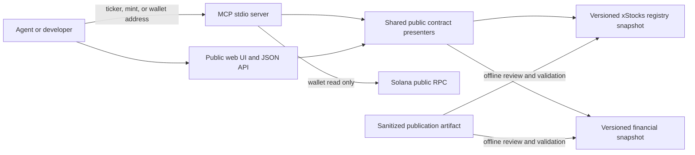
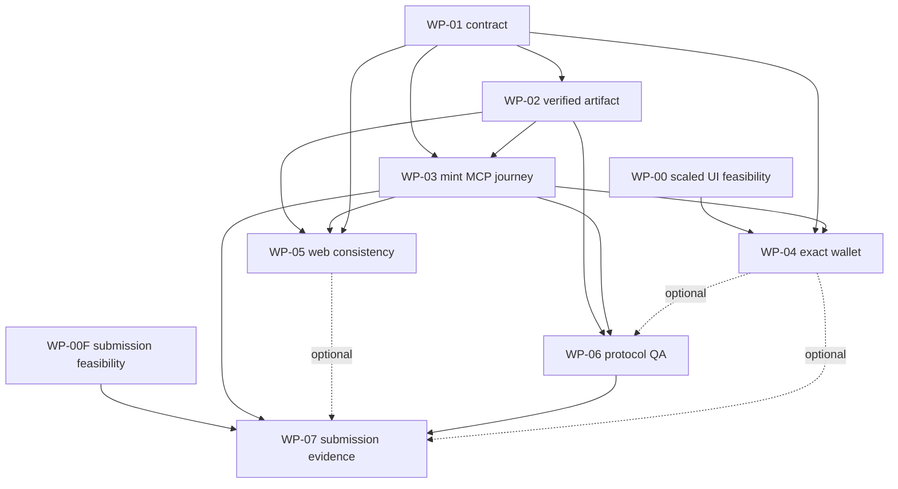

# Benten Product and Delivery Plan

> Historical 2026-09-13 plan. The user-confirmed deadline scope is Main plus **Meteora, PreStocks and Tessera**, defined by the [selected-tracks implementation plan](stocklana-selected-tracks-implementation-plan.md), with the later [purchase-complete MVP plan](stocklana-purchase-mvp-execution-plan.md) controlling acquisition priority and execution. The broader [Stocklana award strategy](stocklana-award-strategy.md) remains decision history and future-capability context; Clawpump, Pyth and Raydium are not deadline dependencies, while Jupiter is only the bounded purchase alternative. This document remains for the completed public-data contract and original delivery evidence; its old facts-only profiles and dates are not the current roadmap.

Status: historical plan superseded for current delivery priority; retained as evidence

For deadline scope and priority, the [2026-09-23 submission plan](stocklana-submission-plan-2026-09-23.md) is now the authoritative document. This document is retained as history.

The current 2026-09-16 revision activity is **plan-only**. Review success does not authorize code, environment, database, wallet, credential, deployment or other external-effect changes. Historical plan-and-build language records earlier scope only; current implementation packages require a fresh authorized turn.

Historical objective (superseded): the former September 18/19 schedule is not a fallback or current deadline. The official page's structured value observed 2026-09-16 sets the current deadline at **2026-09-26 05:00 JST**; current sponsor checkpoints live in the selected-tracks plan and purchase checkpoints in the purchase-complete MVP plan.

## Current schedule and scope correction (2026-09-16)

The current selected product is **investor-first**: it compares provider-specific instruments and market evidence while binding each provider, instrument, market, counterpart mint, role, economics and rights separately. The investor compares PreStocks/Tessera references and inspects the factual state of a DBC base-token market that uses a reviewed xStock as quote asset. DBC operator diagnostics remain a secondary advanced route, not a mandatory step in the investor journey. One exact user-authorized stock-token purchase is now P0 under the dedicated contract; PreStocks/Tessera stay read-only and DBC does not become the execution route. The product remains factual and non-advisory.

The user-confirmed deadline product direction is a non-custodial transaction application that completes the investor journey inside one coherent experience: **discover → compare information and rights → review amount-specific purchase conditions and all known/unknown costs → approve in the user's own wallet → follow submission/pending/confirmed/failed-or-unknown status → verify resulting holdings**. Merely linking to an external venue is not completion. This plan-only revision creates no working Buy action and does not weaken the present no-sign/no-send/no-private-key implementation boundary. The purchase plan defines a future isolated browser exception, route/legal/security gates and separately authorized funded smoke. Existing public APIs may be reused; private analysis and private execution assets remain outside Benten.

The official page hydration reports submission at 2026-09-25 20:00 UTC (September 25 16:00 EDT / **September 26 05:00 JST**) and judging at 2026-10-09 00:00 UTC. Older September 18 and October 2 prose is stale; the latter structured value is not claimed as a winner-announcement date. The displayed cash pool remains USD **121,000**; Pyth is an additional non-cash sponsor track and does not change that cash total. Prize composition is not a development budget, award promise or stacking confirmation. The common rules allow up to three sponsor selections; the user selected Meteora, PreStocks and Tessera. Hidden-form availability, eligibility and stacking remain unverified. PreStocks/Tessera extend the product to distinct provider instruments linked to unlisted companies without inventing fundamental coverage; Clawpump/Pyth remain deferred.

Baseline: repository commit `054d58eb5050ef55921ac62270578f610fceae8e`, inspected 2026-09-13

## 1. Historical product decision

Benten should win one narrow job:

> Given an xStocks mint, return the underlying company and source-verifiable financial facts, with the reporting period, filing date, units, and missing-data state made explicit.

For this superseded facts-only wedge, the primary user was a developer building a Solana agent that could already observe prices or execute transactions but needed a reliable bridge from a token identifier to the company and its filed financial facts. The current deadline and long-term user decisions above supersede that audience priority. Benten still must not imply that it supplies trading advice, complete market coverage, or live financial data.

This historical choice followed a comparison of three product directions. At that time, turning Benten into a trading agent conflicted with the read-only deadline boundary. It is not a permanent rejection of the newly confirmed non-custodial transaction north star; the future milestone must satisfy the separate authority and safety gates described above. The mint-to-company-to-source-backed-facts workflow remains reusable evidence rather than the final product boundary.

The north-star result before the deadline is hackathon evaluation, not revenue. Current adoption, repeated use, and willingness to pay are unmeasured and must be reported as zero evidence rather than inferred from the build.

The minimum hero journey does not require a wallet:

1. Copy the documented MCP command and start Benten locally within five minutes.
2. Submit a known xStocks mint.
3. Receive the token identity, underlying ticker and company, eligibility and snapshot status, and a small set of financial facts.
4. Inspect the fiscal period, filing date, public filing URL, currency or unit, and snapshot revision attached to those facts.
5. Submit the ASML ticker and receive `no_data`, then submit an unknown mint and receive `unknown_mint`. Neither result is described as fraud.
6. Repeat the same calls in an agent client and in the submission demo.

The recommended flagship fact set is deliberately small: revenue and net income attributable to the parent for duration facts, total assets and total liabilities for instant facts, and operating cash flow for a duration cash-flow fact. A field enters the demo only when its exact source context, period, unit, and meaning pass the source ledger. A different directly reported fact may replace one of these when issuer reporting makes the preferred field ambiguous.

A sample-wallet journey is an enhancement. It may enter the submission only after the Token-2022 scaled UI amount gate in WP-00 passes. If it does not pass by the cutoff, the mint journey remains the complete submission.

## 2. Decision status

| Decision | Status | Evidence or rationale | Delivery effect |
|---|---|---|---|
| Optimize first for Stocklana judging and placement | Confirmed | Product owner decision; current structured deadline is 2026-09-26 05:00 JST | Use the award strategy's current D0–D5 checkpoints and retain a nine-hour packet buffer |
| Use mint-to-company-to-filing facts as the wedge | Recommended | xStocks already exposes asset metadata and other token facts; general financial MCP servers already expose statements. The combined, xStocks-specific journey is the narrower differentiation hypothesis | Improve the existing four tools instead of adding a broad tool catalog |
| Keep the runtime snapshot-only | Confirmed | Current security boundary and repository invariant | No database adapter, private upstream connector, or credential enters this repository |
| Complete 3-5 flagship issuers deeply before expanding provenance to all records | Recommended | There are 128 current snapshot rows and fewer than six delivery days. False or synthetic provenance is unacceptable | D1 measures provenance cost; scope contracts if all-record verification misses the cutoff |
| Make the known-mint journey independent of wallet correctness | Recommended | Wallet balance display depends on an unresolved Token-2022 multiplier question | WP-03 can ship if WP-04 is cut |
| Keep current clone-and-build distribution for the submission | Recommended | It already works and avoids package-name and hosted-service work | Package publication and hosted MCP are post-deadline options |
| Treat public GitHub recovery as the only submission route | Rejected | Published rules require at least one GitHub, live-demo, or video link; logged-in form details remain unverified | Prepare multiple accessible evidence links and do not block local delivery on one channel |
| Add multi-year or quarterly history before the deadline | Rejected for submission | Current snapshot contains one annual period per ticker; a correct history backfill requires upstream evidence and a larger contract | Run a post-deadline feasibility gate instead |
| Add authentication, billing, a rate-limit datastore, alerts, or multi-chain support | Rejected for submission | These do not strengthen the selected hero journey enough to justify delivery risk | Reconsider only after measured demand |

## 3. Current baseline

### Confirmed assets

- Four MCP tools exist: `list_xstocks`, `get_fundamentals`, `get_financials`, and `get_wallet_holdings`.
- The registry contains 154 records. Of these, 129 are structurally eligible for SEC-derived facts, 128 have current bundled fundamentals and statement records, and ASML is the explicit eligible `no_data` case.
- The financial snapshot is 320 KB and contains one fiscal-year record per covered ticker. Fundamentals periods are FY2023 (1), FY2024 (1), FY2025 (107), and FY2026 (19). PL is present for 128 records; BS and CF are each present for 127.
- Inputs pass through exact ticker, mint, or Solana-address validation as applicable. Public snapshot fields are allowlisted and reject unknown or nested values.
- The financial tools do not call a network. Wallet lookup uses read-only Solana RPC methods and does not sign or send transactions.
- Local verification on 2026-09-13 passed: workspace production build, workspace typecheck, 52 MCP tests in six files, the built-in publication scan over 63 tracked files, and the Vercel configuration contract. The optional private denylist was not available in the local shell and was therefore not part of that local scanner run.

### Gaps that directly weaken the selected journey

| Gap | Observed effect | Priority |
|---|---|---|
| No public filing accession, filing URL, filing date, period end, currency/unit, artifact publication time, revision, or content digest | An agent cannot verify the claim "on the record" from the response | P0 |
| Financial `as_of` is a fiscal label, not a freshness timestamp | A consumer can mistake fiscal period for collection or filing time | P0 |
| Financial tools accept only a ticker even though the registry can resolve a mint | Mint-to-company-to-facts requires downloading and searching all registry entries first | P0 |
| MCP advertises input schemas but no output schemas or structured content | Agent integrations must parse display text and cannot validate a stable result contract | P0 |
| Wallet returns JavaScript `number` from RPC `uiAmount` and discards raw amount and `uiAmountString` | Precision and Token-2022 scaled-display behavior are not evidenced | P0 for wallet; does not block mint journey |
| `coveredXStocks` means structurally eligible, while the web labels all 129 as having financials and labels ASML `Financials` | Public UI conflicts with the explicit 128-plus-`no_data` model | P1 |
| Snapshot update has no public manifest, diff policy, acceptance command, or rollback runbook | A safe, reproducible refresh cannot be independently reviewed | P1 |
| There is no protocol-level stdio journey test or judge-facing reproducible fixture | Unit tests do not prove copy-command-to-answer behavior | P1 |
| Installation requires clone, install, build, and an absolute path with no automated smoke command | First success is slower and easier to misconfigure than necessary | P1 |
| README market numbers and universe language do not consistently name date and population | Reviewers may compare unlike populations or question unsupported claims | P1 |
| The current home page leads with long-form explanation, the 154-row registry, and wallet connection, with no visible MCP copy/try path | A judge cannot see the mint-to-source wedge immediately | P1 |

## 4. Requirements

| ID | Requirement | Priority | Acceptance condition |
|---|---|---|---|
| R-001 | Resolve an exact known ticker or exact known mint to one registry identity | Must | Both identifiers return the same ticker, symbol, mint, company, and issuer-verification state; malformed and unknown identifiers fail closed |
| R-002 | Return financial facts with explicit period and unit semantics | Must | Every successful flagship response identifies fiscal period, period end, filing date, form, accession, public filing URL, currency/unit, and snapshot revision |
| R-003 | Represent eligibility, capability availability, and source-verification separately | Must | `not_eligible`, `no_data`, `legacy_snapshot`, and `source_verified` cannot be confused on any submitted surface; PL, BS, and CF availability remain independent |
| R-004 | Provide machine-validatable MCP output while retaining defined v1 text compatibility | Must | All four tools advertise output schemas and return matching `structuredContent`; the mint-core profile returns an explicit no-RPC wallet-unavailable result; text remains one JSON object that preserves legacy `data` keys/values and `as_of`, places mint identity and mechanically projected fact-level provenance in `_benten_v2`, and follows C-MCP-04 |
| R-005 | Preserve the public trust boundary | Must | Runtime financial calls remain network-free; snapshot validation and publication scanning fail closed; no signing, sending, private connector, or credential is added |
| R-006 | Demonstrate the complete journey from a clean checkout | Must | A recorded protocol test and a human-run smoke complete setup plus known/unknown/`no_data` calls using the documented commands |
| R-007 | Make wallet amounts exact before using the wallet in judging | Should | A same-observation comparison proves multiplier handling, and output preserves raw and display strings, decimals, display basis, and slot without double application |
| R-008 | Give judges evidence against each published criterion | Must | The evidence matrix links each criterion to a demo timestamp or reproducible artifact |
| R-009 | Validate the problem with target users | Should | Up to five xStocks/Solana agent developers attempt the journey; results record correctness, source trust, setup time, and the highest-friction step |
| R-010 | Keep a recoverable submission | Must | Every selected evidence link is checked from a signed-out context, a local backup demo is recorded, and each implementation unit has a revert path |
| R-011 | Keep submitted evidence reviewable through the judging period | Must | Intended evidence links and the pinned submission version remain available through the observed structured judging deadline, 2026-10-09 00:00 UTC, with a daily lightweight check and an incident owner; this is not a claimed winner date |

## 5. Non-goals before the deadline

- Investment recommendations, scores, valuations, predictions, or autonomous trade execution.
- Complete xStocks coverage across every chain or every product listed on an unrelated aggregate page.
- Prices, proof of reserves, corporate actions, or multiplier schedules as new Benten product surfaces. Official xStocks services already expose these; multiplier data may be consulted only to validate wallet display correctness.
- Multi-period analytics, derived ratios, charts, screening, or portfolio advice.
- A new hosted MCP transport, identity system, payment system, database, scheduler, or monitoring platform.
- Publication of an npm package unless setup testing proves the existing route cannot meet the five-minute target and package ownership is already verified.

### Archived release profiles

The Profile A/B/C cutoffs below are historical evidence only. They do not control the current market-readiness build or justify cutting its selected investor/DBC consumers.

The first executable plan is **Profile A: Mint Core**. It includes source-verified flagship facts, all four MCP output schemas, the known-mint journey, legacy snapshot labeling, protocol E2E, onboarding, and evidence. `get_wallet_holdings` remains discoverable but returns `wallet_correctness_unverified` for a valid address without constructing an RPC connection. The judged surfaces are MCP plus an accessible video or other eligible evidence link. This profile does not depend on WP-00, WP-04, or the redesigned web experience.

**Profile B: Wallet Enhanced** adds exact wallet holdings only after WP-00 proves the display basis and WP-04 passes its replay and bounded live gates. It never delays Profile A.

**Profile C: Web Enhanced** adds the redesigned first viewport only after the accepted mock, implementation, screenshot, and independent visual QA finish by 2026-09-16 12:00 JST. If that cutoff is missed, WP-05 is cut, the existing web URL is excluded from judge evidence unless it independently matches the required data states, WP-07 proceeds with MCP and an accessible video/code artifact, and web-only consistency test T-007B is not a release gate. T-007A still verifies v1 text against v2 structured MCP semantics.

## 6. Architecture and trust boundaries



The inbound artifact boundary is one way. Whatever creates the sanitized artifact is outside this repository and outside the public runtime. Benten accepts only an artifact that satisfies [the public data v2 contract](contracts/public-data-v2.md), exact schemas, hashes, coverage-diff policy, and publication scans.

No persistent database is needed. The physical data model is immutable, version-controlled JSON loaded into memory. Local MCP uses Node.js stdio. The web application is a Next.js deployment reading the same package. Existing runtime and framework major versions remain pinned by `pnpm-lock.yaml`; dependency upgrades are out of scope unless required to use capabilities already present in MCP SDK 1.30.0.

### Planned paths

```text
specs/
  product-plan.md                         # this plan and delivery SSOT
  contracts/public-data-v2.md            # public identity, provenance, amount, and error contract
packages/registry/src/
  snapshot-manifest.json                 # future public artifact metadata
  financials-snapshot.json               # existing v1 legacy snapshot, preserved
  verified-facts-v2.json                 # future source-verified overlay
  financials-snapshot.ts                 # future strict v1+overlay validation and selectors
  public-financial-fields.ts             # future unit and field semantics
  index.ts                               # future eligibility/availability exports
packages/mcp/src/
  server.ts                              # future input/output schemas and structuredContent
  lib/envelope.ts                        # future common response metadata
  tools/*.ts                             # future identifier and response handling
  protocol.e2e.test.ts                   # future stdio end-to-end journey
packages/solana/src/
  index.ts                               # future exact wallet amount contract
  scaled-ui-amount.test.ts               # future replay evidence
apps/web/
  lib/public-presenter.ts                # future shared web response presenter
  app/api/v2/...                         # optional Profile C routes using MCP semantics
  components/CoverageBadge.tsx           # future distinct availability states
scripts/
  check-snapshot-release.mjs             # future manifest, hash, coverage-diff gate
docs/
  data-dictionary.md                     # future public field and unit definitions
  source-verification-ledger.json         # future field-to-source comparison evidence
  snapshot-release.md                    # future refresh and rollback runbook
  design/stocklana-hero-direction.png     # future accepted, digest-bound visual mock
```

Only paths explicitly assigned to a work package may change in that package. New UI work must use the repository's separate design and implementation workflow.

## 7. Judge evidence and product measurements

### Submission evidence matrix

| Judge concern | Evidence to produce | Pass condition |
|---|---|---|
| Real user and problem | Short problem statement plus results from up to five target-developer attempts | At least three attempts; median source trust at least 4/5; every failure and sample size disclosed |
| End-to-end product | 90-120 second recommended demo and protocol transcript | Mint enters once; identity, company, filed facts, source, period, units, `no_data`, and unknown-mint behavior are visible |
| Why Solana | Exact mint resolution and optional exact wallet holdings | The demo begins from a Solana-native identifier; generic ticker-only lookup is insufficient |
| Execution quality | Green CI, clean-checkout smoke, strict negative tests, accessible-link check | All release gates pass on the exact submission commit and the intended GitHub, live, or video evidence opens without the builder's session |
| Focus | Four existing tools and one hero journey | No submission-critical feature lies outside the journey |

The video length is a recommended editorial constraint, not a confirmed platform limit. On D0, the product owner must inspect the logged-in submission form and governing terms in read-only mode, recording required fields, media constraints, originality/attribution requirements, residence or eligibility conditions, and whether submitted links may be edited. Wallet login and form inspection require the appropriate user handoff. Project registration and final submission are separate external actions and are not authorized by this plan.

### Comparative benchmark

The comparison tests workflow completeness. It must not claim that another product lacks a capability without a same-day observation.

Run the same three tasks against (A) official xStocks metadata plus direct SEC API assembly, (B) a general financial MCP, and (C) Benten:

1. Start from a known mint and obtain the correct underlying company.
2. Obtain a revenue fact with period, unit, and inspectable source.
3. Distinguish an unknown mint from an eligible ticker with no current snapshot row.

Record time to first correct fact, number of calls/manual joins, identity correctness, source completeness, missing-state correctness, and observed latency. This is an unverified benchmark until the transcript exists. Benten succeeds if it completes all three tasks without a manual identity join and without an incorrect source or missing-state assertion.

### Fast user validation

Recruit no more than five target users. Give each a clean-checkout instruction and one known mint without coaching. Record:

- setup time, with a target median of five minutes or less;
- whether token, underlying company, and source were interpreted correctly;
- source trust on a 1-5 scale, with a target median of at least 4;
- whether `no_data` and unknown mint were understood as different;
- the first blocking or confusing step.

If fewer than three relevant users are available, report the smaller sample and use judge-facing clean-checkout tests as fallback evidence. Do not relabel internal testers as external users.

## 8. Work packages

Estimates are focused implementation time and can overlap across independent owners. Calendar slack, review, and submission operations are scheduled separately.

The pre-deadline estimate is 7.0 role-days across multiple roles. Profile A's mandatory chain is approximately 4.25 focused days; Profile C's web-enhanced chain is approximately 4.75. Parallel feasibility, contract, QA, and evidence work is required to fit the calendar.

| WP | Owner | Depends on | Estimate | Allowed paths | Output and acceptance | Abort or rollback |
|---|---|---|---:|---|---|---|
| WP-00F Submission feasibility | Product owner with user account handoff | None | 0.25 day | local eligibility checklist only | Inspect the logged-in form and terms in read-only mode; record required fields, permitted evidence links, media constraints, originality/attribution, eligibility, and edit rules. No registration or submission | If the correct account is unavailable, preserve the unverified gate and continue local product work; escalate before evidence production choices become irreversible |
| WP-00 Scaled UI feasibility | Solana engineer | None | 0.5 day | test fixture/evidence paths; later `packages/solana/src/index.ts` only after verdict | Compare a known Token-2022 mint/account at one observed slot against raw amount, RPC display string, mint decimals, and official multiplier metadata. State whether RPC already applies the multiplier. No transaction or signature. | If evidence is unavailable or inconsistent by 2026-09-14 18:00 JST, cut wallet from submission and keep mint journey |
| WP-01 Contract and terminology | System developer | None | 0.5 day | `specs/contracts/public-data-v2.md`, then contract tests | Freeze identifier one-of rules, identity shape, coverage states, period/source/unit metadata, errors, compatibility, and unknown-field policy | Revert contract commit; no runtime state exists |
| WP-02 Source-verified flagship artifact | Data curator + system developer | WP-01 | 1.0 day | registry v1 snapshot, verified v2 overlay, manifest, validator, dictionary, source ledger, release checker and tests | Produce truthful field-level provenance for a directly reported fixed fact set across 3-5 flagship issuers. Keep unverified rows in the legal `legacy_snapshot` union with unknown date/unit/fact kind, and report PL/BS/CF separately. Validate values against source contexts, not merely reachable URLs. FCF stays legacy-only | Reject the artifact on any invented, mismatched, inaccessible, or unparseable source/value; the read-only checker leaves both roots unchanged and the previous snapshot remains active |
| WP-03 Agent-native mint journey and Profile A | System developer | WP-01, WP-02 | 1.0 day | `packages/mcp/src/**`, shared registry selectors and tests | Implement the four explicit request/result unions in C-MCP. The one-object text presenter preserves v1 `data` and `as_of`, replaces the unsafe aggregate financial source label, and mechanically projects identity, artifact revision, legacy warning, and only the verified subset into `_benten_v2`; exact mint is additive inside that object. All four tools advertise output schemas. In Profile A, a valid wallet address returns the structured no-RPC unavailable branch. Known mint, legacy row, partial verified overlay, ASML, SLMT missing BS/CF, unknown, invalid statement, and malformed cases pass | Revert the MCP unit; fail closed if text cannot be projected from the same structured result; no v2 submission profile is claimed until all four schemas and Profile A tests pass |
| WP-04 Exact wallet response | Solana engineer | WP-00, WP-01, WP-03 | 0.75 day | `packages/solana/src/**`, wallet tool/tests, wallet presenter | Optional Profile B: preserve raw amount and display string, record basis and slot, aggregate duplicate mint accounts deterministically, prove no double scaling, and switch the advertised wallet union to its available branch | Cut this WP and all wallet footage if WP-00 or tests fail; Profile A's explicit unavailable result remains valid |
| WP-05 Web consistency and visible journey | UI designer, web developer, then independent UI reviewer | WP-01, WP-02, WP-03 | 1.25 role-days | approved web paths and shared presenter | Optional Profile C: an accepted visual-direction mock precedes implementation. The first viewport shows a concrete mint try-example, token/company distinction, source/period/unit cards, and an MCP copy path without a wallet. The full registry is secondary. Eligibility, capability availability, source verification, and `no_data` remain consistent. A browser screenshot at the accepted viewport passes independent visual QA by the cutoff | Cut WP-05 at 2026-09-16 12:00 JST if acceptance or QA is incomplete. Exclude the old web from judge evidence and continue Profile A; the builder does not self-certify visual acceptance |
| WP-06 Protocol QA and onboarding | Test engineer + system developer | WP-02, WP-03; WP-04 optional | 0.75 day | protocol tests, README, example config, smoke script | Clean checkout reaches first correct fact in <=5 minutes; stdio initialize/list/call transcript covers hero and negative cases; README numbers name date and population or are removed | Restore prior README; retain raw test evidence; block freeze on incorrect output |
| WP-07 Submission evidence and continuity | Product owner + reviewer | WP-00F, WP-03, WP-06; WP-04 and WP-05 optional | Historical estimate; continuity now follows the observed judging deadline | public evidence/docs/video outside product runtime | Consume the D0 form/terms checklist; produce benchmark, user attempts, judge matrix, signed-out evidence-link smoke, backup recording, exact-commit receipt, OSS attribution, and new-versus-existing-work statement. An owner checks submitted links through `2026-10-09T00:00:00Z` unless a later D0 receipt changes it | Exclude failed optional surfaces; do not claim public access or a winner date from the judging timestamp |

### Dependency DAG



WP-00F, WP-00, and WP-01 start in parallel. Dotted edges add evidence to enhanced profiles but are not Profile A dependencies. Profile A follows WP-01 → WP-02 → WP-03 → WP-06 → WP-07, with WP-00F also feeding WP-07. Profile B adds WP-00 → WP-04; Profile C adds WP-05.

Within WP-05, the sequence is visual-direction mock, user/design acceptance, web implementation, same-viewport browser screenshot, then an independent UI review. These are ordered gates inside one work package and may not be collapsed into builder self-approval.

## 9. Current critical path

The superseded six-day facts-only schedule is retained in Git history, not as an executable fallback. The current calendar and cut rules are the single table in the [selected-tracks implementation plan §9](stocklana-selected-tracks-implementation-plan.md#9-calendar-and-cut-rules-jst): contract/fixture checkpoint by **Sep 17 20:00**; selected producer evidence by Sep 19; fake-consumer/design proof by Sep 20; integrated selected consumers and feature freeze by **Sep 22 20:00**; a protected 48-hour investor UI/UX refinement, journey-test and repeat-QA window through **Sep 24 20:00**; signed-out rehearsal and packet preparation on Sep 25; official deadline **Sep 26 05:00 JST**. Missing evidence returns to the claim/RC decision rather than reviving the old deadline/profile or consuming the protected UI window with optional breadth.

Each code work package should be an independently reviewable local commit. External deployment, publication, submission, permission changes, or package release occurs only under the applicable authorization and only after the exact release commit passes its gates.

WP-00F through WP-06 authorize no external write. Their live checks are read-only and bounded. WP-00F may require a user-controlled login handoff but does not submit or register. WP-07 prepares evidence locally; registration, outreach, deployment, publication, and final submission remain separately authorized operations. Every package records the accepted plan and contract digest at kickoff so an implementation agent cannot silently substitute a later contract.

## 10. Verification plan

| Test ID | Requirement | Environment | Planned evidence |
|---|---|---|---|
| T-001 | R-001 | Unit/contract | Exact ticker and mint converge; case and whitespace policy; both/neither identifiers rejected; unknown values fail closed |
| T-002 | R-002, R-003 | Snapshot fixture | Verified filing metadata and values match the source ledger; raw-byte hashes match; the real ABNB legacy row preserves unknown dates/units; ASML remains `no_data`; SLMT reports BS/CF separately |
| T-003 | R-004 | MCP SDK in process | Each of four output schemas validates success/error/unavailable branches; `{ticker}`, `{ticker,statement:"cf"}`, `{mint}`, statement omission, missing BS, and invalid statement follow C-MCP. Each text result is one parseable JSON object; legacy ABNB preserves exact `data` keys/values and `as_of`, uses the fixed unverified source/warning, and mint identity stays inside `_benten_v2` |
| T-004 | R-005 | Static and negative tests | No network in financial tools; unknown fields/nested values/non-finite values/signing primitives/private patterns rejected |
| T-005 | R-006 | Spawned stdio process from clean build | Initialize, list tools, known mint, ASML, and unknown mint produce golden semantic results |
| T-006A | R-004 | Mint-core unit/protocol | Valid wallet input returns `wallet_correctness_unverified` without constructing a Solana connection; malformed input returns `invalid_input`; all four tools remain advertised |
| T-006B | R-007 | Optional fixture replay plus bounded mainnet read | Profile B raw/display amount, decimals, multiplier basis, slot, aggregation, zero, malformed RPC, and both token programs behave as contracted |
| T-007A | R-003 | Mandatory MCP contract | For flagship, partial-overlay, legacy ABNB, ASML, SLMT missing statements, unknown, and ineligible cases, `_benten_v2` is mechanically equal to the identity, coverage, artifact revision, and expanded verified references in structured MCP; every `/data` descendant remains legacy, and a missing or divergent reference fails closed |
| T-007B | R-003 | Optional Web/API contract and browser | Profile C MCP, JSON API, and accepted web presenter agree on the same cases and pass same-viewport independent visual QA |
| T-008 | R-008, R-010 | Production build and signed-out client | Exact commit builds, selected submission links open, MCP instructions work, and the backup recording opens; web source revision is required only if web is submitted |
| T-009 | R-009 | Moderated clean-checkout attempts | Setup time and interpretation rubric recorded without hidden coaching |
| T-010 | R-011 | Signed-out check through 2026-10-09 00:00 UTC | Submitted links, pinned version, and displayed freshness remain available through the observed judging deadline; incidents and recovery are recorded without calling it the winner date |

Profile A failure injection covers source URL/value mismatch, raw-byte hash mismatch, unknown snapshot field, unknown legacy date/unit preservation, missing statement, wallet-unavailable behavior, and tool handler exception. Profile B additionally covers inaccessible RPC, RPC response without optional display fields, duplicate mint accounts, and scaled-amount boundaries. The mandatory gate is build + typecheck + full Profile A tests + publication scan + deployment-configuration contract + stdio E2E. T-006B and T-007B join the gate only when their enhanced profiles are selected. The local private denylist and any hosted availability check remain separate environment-specific gates.

## 11. Operations, recovery, and cost

The submission architecture adds no persistent storage. Snapshot rollback is `git revert` of the independently committed artifact update followed by the same release gates. MCP rollback is reselecting the previous exact commit. The web rollback is redeploying the previous verified artifact through the established deployment owner. Target RPO is the last accepted snapshot release; target RTO for a faulty submission build is 30 minutes, subject to deployment-provider availability.

The current market-readiness target may require a separately operated quote/provider owner, BFF and shared admission store; their production cost is **unverified**, and no paid service is authorized by this plan. Local fixtures and bounded anonymous public reads do not prove production capacity. Before a paid choice, measure owner RPC/provider calls and bytes per quote/DBC/provider-asset observation, BFF/admission operations per journey, p50/p95 latency, 429/5xx rate, low/base/10× monthly traffic, account/host/store/monitoring fixed cost and current provider unit prices. Apply [multi-venue acquisition plan §4](multi-venue-acquisition-plan.md#4-security-policy-migration-operations-and-cost): `daily requests × calls/request × price/call × 30 + host + cache + monitoring + fixed API plan`, with an explicit monthly cap at the purchase decision. A free tier is not zero-cost capacity, and the USD 121,000 prize pool is not a project budget.

Operational signals before the deadline are intentionally bounded: CI result on the exact commit, snapshot/market-evidence revisions and hashes, signed-out page/API smoke, MCP stdio smoke, quote/BFF failure isolation, and the selected no-effect Solana observations. The current production home was observed reachable historically, but its deployed source version was not verified; the release gate must identify the exact submission version. From submission through the observed 2026-10-09 00:00 UTC judging deadline, the owner performs a daily signed-out check of every submitted link and records outage/recovery. This date is not asserted as winner announcement.

## 12. Traceability

| Requirement | Contract | Planned implementation path | Work package | Verification |
|---|---|---|---|---|
| R-001 | C-ID-01, C-ID-02 | registry selectors; MCP financial tools | WP-01, WP-03 | T-001, T-005 |
| R-002 | C-FIN-01, C-FIN-02, C-SRC-01 | legacy snapshot, verified overlay, validator, financial tools | WP-02, WP-03 | T-002, T-003 |
| R-003 | C-COV-01, C-ERR-01 | registry exports and MCP presenter; optional API/UI presenter | WP-01, WP-03; WP-05 optional | T-001, T-007A; T-007B optional |
| R-004 | C-MCP-01 through C-MCP-04 | MCP server and envelope | WP-03 | T-003, T-005, T-006A |
| R-005 | C-SEC-01 | snapshot validator, scanner, MCP and optional Solana boundaries | WP-02, WP-03; WP-04 optional | T-004, T-006A; T-006B optional |
| R-006 | C-MCP-01 | stdio E2E, README and smoke command | WP-06 | T-005, T-008 |
| R-007 | C-WAL-01 | Solana reader and wallet tool | WP-00, WP-04 | T-006B |
| R-008 | C-EVD-01 | evidence matrix and demo artifacts | WP-00F, WP-07 | T-008 |
| R-009 | C-EVD-02 | validation script and result table | WP-07 | T-009 |
| R-010 | C-OPS-01 | release runbook and backup artifacts | WP-06, WP-07 | T-008 |
| R-011 | C-OPS-02 | pinned submission receipt and continuity checklist | WP-07 | T-010 |

## 13. Post-deadline 30-day gates

Work begins only when the named evidence exists:

1. **Historical facts:** sample ten eligible issuers and verify whether three annual periods can be published with the same source/unit contract. Proceed only if at least 90% of required core facts have valid provenance and payload/setup performance remains acceptable.
2. **Distribution:** first get five relevant teams to attempt setup. Consider a package or remote MCP only if setup failures or median setup time show that clone-and-build blocks use. Verify package-name ownership and release signing before selecting npm.
3. **Repeated and paid demand:** seek five relevant team trials and require at least two teams to repeat the workflow in a separate session before treating use as retained. Test willingness to pay with a concrete hosted-freshness/uptime offer; do not promise a paid SLA unless at least two teams state a usable price or procurement condition. The likely model is a free local snapshot core plus optional hosted freshness and uptime, but it remains a hypothesis until this gate passes.
4. **Dedicated RPC:** move beyond public RPC only when wallet usage and observed throttling justify a provider cost model.
5. **Broader official xStocks data:** add price, reserve, multiplier, or corporate-action surfaces only if users prefer a single joined workflow to the official API and the result remains a focused product.

## 14. Open and unverified gates

- The Token-2022 scaled UI behavior for the exact xStocks mint, RPC method, provider, and observation time must be measured in WP-00. Current code alone does not prove whether the RPC value already includes a multiplier.
- Provenance availability and verification effort for all 128 snapshot records is unknown until WP-02 samples real records. The submission is allowed to expose a clearly labeled source-verified subset.
- Comparative benchmark results, user-validation results, public deployment availability, provider limits, package-name availability, and submission-form media constraints are future evidence, not current facts.
- The public repository state needed for judging is an external release gate. It does not block local implementation, but the submission cannot claim reproducibility until a signed-out reviewer can access the intended artifacts.
- The logged-in submission form, detailed eligibility terms, media constraints, and post-deadline edit behavior are unverified. Read-only inspection is a D0 gate; registration and submission require separate authority.

## 15. External references

These sources inform scope; they do not replace the planned same-day benchmark.

- [Stocklana hackathon](https://hackathons.solana.com/hackathons/stocklana) — structured schedule and displayed prize composition rechecked 2026-09-16; conflicting older prose is stale.
- [xStocks developer documentation](https://docs.xstocks.fi/developers) — official metadata, price, multiplier, reserve, and corporate-action surfaces, checked 2026-09-13.
- [SEC EDGAR APIs](https://www.sec.gov/search-filings/edgar-application-programming-interfaces) — public filing and XBRL API behavior, including period and unit considerations, checked 2026-09-13.
- [SEC non-GAAP financial measures interpretations](https://www.sec.gov/rules-regulations/staff-guidance/corporation-finance-interpretations/non-gaap-financial-measures) — free-cash-flow naming and calculation require explicit disclosure and are not treated as a uniform reported fact in the deadline contract, checked 2026-09-13.
- [Alpha Vantage MCP](https://mcp.alphavantage.co/) — observed general financial MCP baseline, checked 2026-09-13.
- [Solana Agent Kit v2](https://github.com/sendaifun/solana-agent-kit/tree/v2) — observed Solana agent execution and plugin baseline, checked 2026-09-13.
- [Model Context Protocol tools specification](https://modelcontextprotocol.io/specification/2025-11-25/server/tools) — output schemas and structured tool results, checked 2026-09-13.
